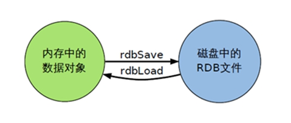

前言

详细文档参考：

[尚硅谷_Redis6课件.docx](./尚硅谷_Redis6课件.docx)

# 1、NoSQL数据库简介

## 1.1、技术发展

技术分类：

+ 解决功能性的问题：Java、Jsp、RDBMS、Tomcat、HTML、Linux、JDBC、SVN
+ 解决扩展性的问题：Struts、Spring、SpringMVC、Hibernate、Mybatis
+ 解决性能的问题：NoSQL、Java线程、Hadoop、Nginx、MQ、ElasticSearch

## 1.2、NoSQL数据库

### 1.2.1、NoSQL数据库概述

NoSQL即Not Only SQL，意思为“不仅仅为是SQL”，泛指**非关系型的数据库**。

NoSQL不依赖业务逻辑方式存储，而是以简单的`key-value`模式存储。因此大大的增加了数据库的扩展能力。

**NoSQL特点：**

+ 不遵循SQL标准

+ 不支持ACID（但是支持事务）

  > 即事务的四个个性：原子性、一致性、隔离性、持久性

+ 远超SQL的性能

### 1.2.2、NoSQL适用场景

+ 对数据高并发的读写
+ 海量数据的读写
+ 对数据高可扩展性的

### 1.2.3、NoSQL不适用场景

+ 需要事务支持
+ 基于sql的结构化查询存储，处理复杂的关系，需要**即席**查询
+ <font color='red'>用不着sql的和用了sql也不行的情况下，请考虑用NoSQL</font>

### 1.2.4、常见的NoSQL数据库

+ Memcache
+ Redis
+ MongoDB

# 2、Redis6概述和安装

## 2.1、Redis安装

安装版本：redis-6.2.1.tar.gz

```sh
#下载安装最新版的gcc编译器 8.3.1
yum install centos-release-scl scl-utils-build
yum install -y devtoolset-8-toolchain
scl enable devtoolset-8 bash
gcc -version

#解压redis文件
tar -zvxf redis-6.2.1.tar.gz
# 编译安装
cd redis-6.2.1.tar.gz/
make
make install # 程序默认安装在 /usr/local/bin目录下
```

## 2.2、redis文件介绍

***`/usr/local/bin 目录下redis程序：`***

+ `redis-benchmark`：性能测试工具
+ `redis-check-aof`：修复有问题的AOF文件，rdb和aof后面讲
+ `redis-check-dump`：修复有问题的dump.rdb文件
+ `redis-sentinel`：Redis集群使用
+ `redis-server`：Redis服务器启动命令
+ `redis-cli`：客户端，操作入口

***`Redis加压的目录下 redis配置文件`*** 

+ 

## 2.3、Redis前台启动（不推荐）

> </img>

## 2.4、Redis后台启动（推荐）

+ **备份`redis.conf`文件**

  > 将redis解压后目录下的`redis.conf`拷贝到`/etc`目录下（当然你可以放到其他任意目录）

+ **后台启动设置<font color='red'>daemonize no</font>改为<font color='red'>daemonize  yes</font>**

  > `redis.conf`配置文件里的`daemonize no` 改成`daemonize yes`，让服务器在后台启动（可以关键字搜索：/deam）

+ **根据redis的配置文件，启动redis**

  > ```sh
  > #需要进入redis-server所在的目录
  > redis-server /etc/redis.conf
  > ```

+ **检查redis进程**

  > ```sh
  > ps -ef|grep 'redis'|grep -v 'grep'
  > ```
  >
  > 

+ **通过`redis-cli`连接到redis服务**

  > ```sh
  > /usr/local/bin/redis-cli 
  > ```

## 2.5、Redis关闭

+ 进入redis客户端即`redis-cli`中，输入命令`shutdown`
+ 或者在命令行中，根据redis的pid杀掉

## 2.6、Redis相关知识

### 2.6.1、Redis端口6379来历

6379在是手机按键上MERZ对应的号码，而MERZ取自意大利歌女Alessia Merz的名字。MERZ长期以来被Redis作者antirez及其朋友当作愚蠢的代名词。后来Redis作者在开发Redis时就选用了这个端口。

### 2.6.2、==Redis数据库==

+ Redis默认16个数据库，类似于数组下标从0开始，<font color='red'>初始默认使用0号数据库</font>
+ 切换不同的数据库，通过`select 下标`
+ 16个数据统一密码管理，即所有库密码相同
+ <font color='red'>`dbsize命令`</font>查看当前数据库的key的数量
+ <font color='red'>`flushdb命令` </font>清空当前库
+ <font color='red'>`flushall命令` </font>通杀所有数据库

### 2.6.2、Redis底层原理

**Redis是单线程+多路IO复用技术**

多路复用是指使用一个线程来检查多个文件描述符（Socket）的就绪状态，比如调用select和poll函数，传入多个文件描述符，如果有一个文件描述符就绪，则返回。否则阻塞直到超时。得到就绪状态后进行真正的操作可以在同一个线程里执行，也可以启动线程执行（如使用线程池）


**举例：**


# 3、常用的5大数据类型

哪里去获得redis常见数据类型操作命令http://www.redis.cn/commands.html

## 3.1、Redis键（key）常用命令

```sh
# 查看当前数据库中的所有key
keys *
# 判断某个key是否存在
exists key
# 查看某个key是什么类型
type key


# 删除指定key的数据 【立马删除】
del key
# 根据value选择非阻塞删除 【仅将key从keyspace元数据中删除，真正的删除会在后续异步操作】
unlink key


# 给key设置过期时间，默认单位为s 【不设置默认为永不过期即-1】
expire key 10 # 表示某个key 在10秒钟后过期
# 查看某个key还有多少秒过期， -1表示永不过期  -2表示已经过期（过期就自动删除了）
ttl key

# 切换数据库0-15
select 0~15
#查看当前数据库key的个数
dbsize
# 清空当前数据库
flushdb
# 通杀所有数据库
flushall


```

## 3.2、Redis字符串（String）

### 3.2.1、简介

String是Redis最基本的类型，你可以理解为与Memcache一模一样的类型，一个key对应一个value

<font color='red'>String类型是二进制安全的。这意味着Redis的string可以包含任何数据。比如jpg图片或者序列化的对象</font>

String类型是Redis最基本的数据类型，<font color='red'>一个Redis中字符串value最多可以是512M</font>

### 3.2.2、常用命令

```sh
# 存值 【如果多次存储的key相同，则只保存最新的值】
set key value
# 取值
get key

# 将值追加到该key对应的原来的value上，并返回追加后value的总长度 【如果原来不存在则，等价于set】
append k1 v100 # 如果k1原来是abc，则更新后为abcv100，并返回长度7 ，如果原来k1不存在，则就是存储set

# 获取某个key的长度，如果key不存在则返回0
strlen k1 #返回4


# 仅在key不存在时，设置生效 比如k1已经存在，再使用stenx就不会生效【区别于set】
setnx key value

# 将某个key对应的value数字+1 【仅对数字类型生效，否则会报错】，如果key不存在，则等价于set key 1
incr key
# 将某个key对应的value数字-1 【进队数字类型生效，否则会报错】，如果key不存在，则等价于set key -1
decr key
# 将值增加或减少制定步长
incrby/decrby key step # incrby key 5

# 同时设置一个或多个key-value 
mset k1 v1 k2 v2 ...
# 同时获取一个或多个value
mget k1 k2 k3 ...
# 同时设置一个或多个key-value，当且仅当所有给定的key均不存在 [根据原子性有一个失效则都失败,即只要有一个key存在则全都失效]
msetnx k1 v1 k2 v2 ...

# 获取某个key对应value的指定长度子字符串，类似java中substring
getrange key 0 3 # 获取value的指定长度，越界了会报错
# 用value覆写key所存储的字符串值，从起始位置开始，（索引从0开始）可以设置任意位置，如果越界了，中间空的用\x00表示
setrange key 0 lucy # 将key对应的value从0开始长度为lucy长度的字符串替换为lucy，如原来为aaaahello则替换成了lucyhello

# 设置值的时候设置过期时间   秒为单位
setex key 过期秒数 value


#以新值换旧值，设置新值的同时返回旧值，如果key不存在则返回空
getset key value
```


**与Java比较：**


### 3.2.3、底层数据结构

String的数据结构为简单动态字符串(Simple Dynamic String,缩写SDS)。是可以修改的字符串，内部结构实现上类似于Java的ArrayList，采用预分配冗余空间的方式来减少内存的频繁分配.


如图中所示，内部为当前字符串实际分配的空间capacity一般要高于实际字符串长度len。**当字符串长度小于1M时，扩容都是加倍现有的空间，如果超过1M，扩容时一次只会多扩1M的空间。需要注意的是字符串最大长度为512M。**


## 3.3、Redis列表（List）

### 3.3.1、简介

单键多值

Redis列表是简单的字符串列表，按照插入顺序排序。你可以添加一个元素到列表的头部（左边）或者尾部（右边）

它的底层实际是一个<font color='red'>双向链表,对两端的操作性能很高，通过索引下标的操作中间的节点性能会较差。</font>


### 3.3.2、常用命令

```sh
# 从左边/右边插入一个或多个值
lpush k1 v1 v2 v3 ... # 存储的效果：v3 v2 v1  【头插法】
rpush k1 v1 v2 v3... # 存储的效果：v1 v2 v3 【尾插法】

# 从key对应的list中取值，从左向右取值 包含start和stop
lrange key start stop # lrange key 0 -1表示取出所有

# 从左边或右边吐出countg个值  【值在键在，值光键就不存在了】
lpop key count
rpop key count

# 从key1列表右边吐出一个值，放到key2的左边
rpoplpush key1 key2

# 根据指定index位置，获取key的元素 【从0开始，-1表示最后一个元素】
lindex key index

# 指定key的，在value的前面面插入newvalue值
linsert key before value newvalue
# 指定key的，在value的后面插入newvalue值
linsert key after value newvalue

# 从左边开始删除n个value 【list中重复的value值，不重复也可以】
lrem key n value

# 将key对应列表的第index元素替换为newvalue 【下标从0开始】
lset key index newvalue
```


### 3.3.3、底层数据结构

List的数据结构为快速链表quickList。

首先在列表元素较少的情况下会使用一块连续的内存存储，这个结构是ziplist，也即是压缩列表。

它将所有的元素紧挨着一起存储，分配的是一块连续的内存。当数据量比较多的时候才会改成quicklist。


因为普通的链表需要的附加指针空间太大，会比较浪费空间。比如这个列表里存的只是int类型的数据，结构上还需要两个额外的指针prev和next。


## 3.4、Redis集合（Set）

### 3.4.1、简介

<font color='red'>Redis set对外提供的功能与list类似是一个列表的功能，特殊之处在于set是可以自动排重的，且是无序的</font>，当你需要存储一个列表数据，又不希望出现重复数据时，set是一个很好的选择，并且set提供了判断某个成员是否在一个set集合内的重要接口，这个也是list所不能提供的。

<font color='yellow'>Redis的Set是String类型的无序集合。它的底层其实就是一个value为null的hash表，所以添加，删除，查找的复杂度都是O(1)。</font>

一个算法，随着数据的增加，执行时间的长短，如果是O(1)，数据增加，查找数据的时间不变。

### 3.4.2、常用命令

```sh
# 将一个或多个member元素加入到集合key中，已经存在的member元素将被忽略
sadd key value1 value2 value3 ...

# 取出集合中所有的值
smembers key

# 判断集合key中是否含有该value值，如果有返回1，否则返回0
sismember key value

# 返回集合key中元素的个数
scard key

# 删除集合key中一个或多个member元素，返回删除member元素个数
srem key value1 value2 ...

# 随机从集合key中吐出一个member元素，并返回【值无键无】
spop key

# 随机从该集合中取出n个值。不会从集合中删除
srandmember key n

# 把source中value值移动到destination集合 【原集合中就没有value了】
smove source destination value

# 返回两个集合的交集元素
sinter key1 key2
# 返回两个集合的并集元素
sunion key1 key2
# 返回在key1集合中不在但是不在key2集合中元素的值（key1中的差集）
sdiff key1 key2
```


### 3.4.3、底层数据结构

Set数据结构是dict字典，字典是用哈希表实现的。


## 3.5、Redis哈希（Hash）

### 3.5.1、简介

Redis hash 是一个键值对集合。

Redis hash 值value是一个string类型的 **filed** 和 **value** 的映射表，hash特别适合用于存储对象。类似Java中的Map<String,Object>

比如：用户Id为查找的key，存储的value为用户对象包含：姓名、年龄、生日等信息，如果用普通的key/value结构 来存储，主要有以下三种存储方式：


### 3.5.2、常用命令

```sh
# 给hash集合只能怪添加key field1-value1 ...
hset key field1 value1 ... # 例如：key为身份证，field为名字，value为名字对应的值
hmset key field1 value1 ... # 和上面效果一样
# 从hash集合中取出field字段对应的数据
hget key field
# 判断hash集合中 给定field是否存在（存在返回1）
hexists key field
# 列出hash集合中所有的field
hkeys key
# 列出hash集合中所有的value
hvals key
# 给hash集合中指定field的值+increment（步长必须设置），如果指定field不存在则设置field的值为increment
hincrby key field increment
# 给hash集合中field设置值为value（仅在field不存在时生效，成功返回1） 【原子操作，一荣俱荣，一损俱损】
hsetnx key field1 value1 ...
```

### 3.5.3、底层数据结构

Hash 类型对应的数据结构是两种：ziplist（压缩列表），hashtable（哈希表）。当field--value长度较短且个数较少时，使用ziplist，否则就使用hashtable


## 3.6、Redis有序集合（ZSet）

### 3.6.1、简介

Redis 有序集合 zset 与普通集合 set非常相似，<font color='red'>都是一个没有重复元素的字符串集合。</font>

不同之处是有序集合 zset 的每个成员都关联一个**评分（score）**，这个评分（score）被用来按照从最低分到最高分的方式排序集合中的成员。<font color='red'>集合的成员是惟一的，但是评分Score是可以重复的</font>。

因为元素是有序的，所以你可以和很快的根据**评分score**或者**次序position**来获取一个范围的元素。

访问有序集合 zset 的中间元素也是非常快的，因此你能够使用有序集合作为一个没有重复成员的智能列表。

### 3.6.2、常用命令

```sh
# 将一个或多个member元素及其score值加入到有序集key中 【按照score从小到大排序】
zadd key score1 value1 score2 value2 ...

# 返回有序集key中，下标在start和stop之间的元素 ，可选参数WITHSCORES加上会返回评分score【按照score从小到大排序】
zrange key start stop [WITHSCORES]

# 返回有序集key中，所有score值介于min和max之间（包含min和max）的成员，【按照score从小到大排序】，limit offset count表示偏移offset位，取出count个值 类似于mysql的limit分页
# 翻译：限制从第offset开始（下标从0开始）截取count个元素
zrangebyscore key min max [withscores] [limit offset count]

# 同上zrangebyscore ，效果为从大到小排序
zrevrangescore key max min [withscores] [limit offset count]

# 为有序集key的 value对应的score值 + increment
zincrby key increment value

# 删除有序集key中，指定member的元素
zrem key member1 ...

# 统计有序集key，评分score在min和max中的元素个数(包含min和max)
zcount key min max

# 返回指定member元素在有序集key中的排名（从0开始）  【按照score从小到大排序】
zrank key member
```

###3.6.3、底层数据结构

SortedSet（zset）是Redis 提供的一个非常特别的数据结构，一方面它等价于Java的数据结构Map<String,Double>，可以给每一个元素value赋予一个权重score，另一方面它又类似与TreeSet，内部的元素会按照权重score进行排序，可以得到每个元素的名次，还可以通过score的范围来获取元素的列表。

zset底层使用了两个数据结构：

+ hash，hash的作用就是关联元素value和权重score，保障元素value的唯一性，可以通过元素value找到相应的score值。

+ 跳跃表，跳跃表的目的在于给元素value排序根据score的范围获取元素列表。

  > 跳跃表参考：[尚硅谷_Redis6课件.docx](./尚硅谷_Redis6课件.docx) 3.6.4章节

# 4、Redis6配置文件详解

## 4.1、Units 单位

配置大小单位，开头定义了一些基本的度量单位，<font color='red'>**只支持bytes，不支持bit**，且大小写不敏感。</font>

> ```sh
> # Note on units: when memory size is needed, it is possible to specify
> # it in the usual form of 1k 5GB 4M and so forth:
> #
> # 1k => 1000 bytes
> # 1kb => 1024 bytes
> # 1m => 1000000 bytes
> # 1mb => 1024*1024 bytes
> # 1g => 1000000000 bytes
> # 1gb => 1024*1024*1024 bytes
> #
> # units are case insensitive so 1GB 1Gb 1gB are all the same.
> 
> ```

## 4.2、INCLUDES 包含

类似于jsp中的inclue，多实例的情况下可以把公用的配置文件提取出来。

> ```sh
> ################################## INCLUDES ###################################
> 
> # Include one or more other config files here.  This is useful if you
> # have a standard template that goes to all Redis servers but also need
> # to customize a few per-server settings.  Include files can include
> # other files, so use this wisely.
> #
> # Note that option "include" won't be rewritten by command "CONFIG REWRITE"
> # from admin or Redis Sentinel. Since Redis always uses the last processed
> # line as value of a configuration directive, you'd better put includes
> # at the beginning of this file to avoid overwriting config change at runtime.
> #
> # If instead you are interested in using includes to override configuration
> # options, it is better to use include as the last line.
> #
> # include /path/to/local.conf
> # include /path/to/other.conf
> ```

## 4.3、MODULES  模块

## 4.4、NETWORK 网络

### 4.4.1、bind

bind表示绑定可以访问redis服务的ip地址，默认只允许本机访问

```sh
# 默认为只允许本机ipv4和ipv6访问，
# 每个ip地址都可以加上前缀 - 表示就算此ip地址不可用，redis也可以正常启动
# ::1 表示仅监听ipv4和ipv6的回环接口
bind 127.0.0.1 -::1
```

> ```sh
> # By default, if no "bind" configuration directive is specified, Redis listens
> # for connections from all available network interfaces on the host machine.
> # It is possible to listen to just one or multiple selected interfaces using
> # the "bind" configuration directive, followed by one or more IP addresses.
> # Each address can be prefixed by "-", which means that redis will not fail to
> # start if the address is not available. Being not available only refers to
> # addresses that does not correspond to any network interfece. Addresses that
> # are already in use will always fail, and unsupported protocols will always BE
> # silently skipped.
> 
> # Examples:
> #
> # bind 192.168.1.100 10.0.0.1     # listens on two specific IPv4 addresses
> # bind 127.0.0.1 ::1              # listens on loopback IPv4 and IPv6
> # bind * -::*                     # like the default, all available interfaces
> #
> # ~~~ WARNING ~~~ If the computer running Redis is directly exposed to the
> # internet, binding to all the interfaces is dangerous and will expose the
> # instance to everybody on the internet. So by default we uncomment the
> # following bind directive, that will force Redis to listen only on the
> # IPv4 and IPv6 (if available) loopback interface addresses (this means Redis
> # will only be able to accept client connections from the same host that it is
> # running on).
> 
> ```

### 4.4.2、protected-mode 

默认只支持本机访问

```sh
# protected-mode no （关闭保护模式）允许远程访问
protected-mode yes # 开启保护模式
```

> ```sh
> # Protected mode is a layer of security protection, in order to avoid that
> # Redis instances left open on the internet are accessed and exploited.
> #
> # When protected mode is on and if:
> #
> # 1) The server is not binding explicitly to a set of addresses using the
> #    "bind" directive.
> # 2) No password is configured.
> #
> # The server only accepts connections from clients connecting from the
> # IPv4 and IPv6 loopback addresses 127.0.0.1 and ::1, and from Unix domain
> # sockets.
> #
> # By default protected mode is enabled. You should disable it only if
> # you are sure you want clients from other hosts to connect to Redis
> # even if no authentication is configured, nor a specific set of interfaces
> # are explicitly listed using the "bind" directive.
> ```

### 4.4.3、port

端口号默认为：6379

```sh
# Accept connections on the specified port, default is 6379 (IANA #815344).
# If port 0 is specified Redis will not listen on a TCP socket.
port 6379
```

### 4.4.4、tcp-backlog

<font color='red'>设置tcp的backlog，backlog其实就是一个连接队列，backlog队列总和=未完成三次握手队列+已经完成三次握手队列</font>

在高并发环境下你需要一个高backlog值来避免慢客户端连接问题

<font color='red'>注意Linux内核会将这个值减小到`/proc/sys/core/somaxconn的值（128）`，所以需要确认增大`/proc/sys/core/somaxconn`和`/proc/sys/net/ipv4/tcp_max_syn_backlog(128)`两个值来达到想要的效果。</font>

```sh
# TCP listen() backlog.
#
# In high requests-per-second environments you need a high backlog in order
# to avoid slow clients connection issues. Note that the Linux kernel
# will silently truncate it to the value of /proc/sys/net/core/somaxconn so
# make sure to raise both the value of somaxconn and tcp_max_syn_backlog
# in order to get the desired effect.
tcp-backlog 511
```

### 4.4.5、unixsocket

```shell
# Unix socket.
#
# Specify the path for the Unix socket that will be used to listen for
# incoming connections. There is no default, so Redis will not listen
# on a unix socket when not specified.
#
# unixsocket /run/redis.sock
# unixsocketperm 700
```

### 4.4.6、timeout（为redis服务主动行为）

表示连上redis服务器，但是很久没有操作，该链接会不会超时断掉。

<font color='red'>0表示永远不超时，以秒单位</font>

```sh
# Close the connection after a client is idle for N seconds (0 to disable)
timeout 0
```

### 4.4.7、tcp-keeplive（为tcp协议行为）

tcp-keepalive：TCP 心跳包，如果设置为非零，则在与客户端缺乏通讯的时候使用 SO_KEEPALIVE 发送 tcp acks 给客户端；如果设置成零值，redis-server 将不使用 TCP 协议栈提供的保活机制，会认为客户端连接一直存在，不会有 TCP 的 KEEPALIVE 报文在 redis 客户端和服务端传输。

即连上redis很久没有做操作，redis每隔300秒检测连接是不是还活著（操作），如果还活著就保持连接，否则断掉连接。

```sh
# TCP keepalive.
#
# If non-zero, use SO_KEEPALIVE to send TCP ACKs to clients in absence
# of communication. This is useful for two reasons:
#
# 1) Detect dead peers.
# 2) Force network equipment in the middle to consider the connection to be
#    alive.
#
# On Linux, the specified value (in seconds) is the period used to send ACKs.
# Note that to close the connection the double of the time is needed.
# On other kernels the period depends on the kernel configuration.
#
# A reasonable value for this option is 300 seconds, which is the new
# Redis default starting with Redis 3.2.1.
tcp-keepalive 300
```

## 4.5、GENERAL

### 4.5.1、daemon

redis的后台启动，默认不可以。

```sh
daemon no # 默认不开启后台启动
daemon yes #开启后台启动，且redis进行pid 保存在/var/run/redis.pid
```

### 4.5.2、pidfile

redis服务进程pid保存文件。

```sh
# 默认为/var/run路径下的 redis_6379.pid文件
pidfile /var/run/redis_6379.pid
```

### 4.5.3、loglevel

redis服务输出的日志级别，默认为 **notice**

```sh
# Specify the server verbosity level.
# This can be one of:
# debug (a lot of information, useful for development/testing)
# verbose (many rarely useful info, but not a mess like the debug level)
# notice (moderately verbose, what you want in production probably)
# warning (only very important / critical messages are logged)
loglevel notice
```

### 4.5.4、logfile

设置redis服务的日志输出位置，默认为空

```sh
# Specify the log file name. Also the empty string can be used to force
# Redis to log on the standard output. Note that if you use standard
# output for logging but daemonize, logs will be sent to /dev/null
logfile ""
```

### 4.5.5、databases

设置redis的数据库个数，默认为16个

```sh
# Set the number of databases. The default database is DB 0, you can select
# a different one on a per-connections basis using SELECT <dbid> where
# dbid is a number between 0 and 'databases'-1
databases 16
```

## 4.6、SECURITY

Redis 默认是没有密码的，当然你也可以自己设置。

两种方法：

+ **redis.conf配置文件中将取消注释`requirepass foobared`（永久生效）**

  ```sh
  # requirepass foobared
  requirepass yourpassword
  ```

+ **连接redis-cli后通过命令设置密码（临时，重启redis后密码就会失效）**

  ```sh
  # 获取配置文件密码
  config get requirepass
  # 命令设置临时密码 123456
  config set requirepass "123456"
  # 设置成功后，使用前需要登陆认证
  auth "123456"
  ```

## 4.7、LIMITS

### 4.7.1、maxclients

  设置最大客户端连接数，默认不限制。

  ```sh
  ################################### CLIENTS ####################################
  
  # Set the max number of connected clients at the same time. By default
  # this limit is set to 10000 clients, however if the Redis server is not
  # able to configure the process file limit to allow for the specified limit
  # the max number of allowed clients is set to the current file limit
  # minus 32 (as Redis reserves a few file descriptors for internal uses).
  #
  # Once the limit is reached Redis will close all the new connections sending
  # an error 'max number of clients reached'.
  #
  # IMPORTANT: When Redis Cluster is used, the max number of connections is also
  # shared with the cluster bus: every node in the cluster will use two
  # connections, one incoming and another outgoing. It is important to size the
  # limit accordingly in case of very large clusters.
  #
  # maxclients 10000 
  ```

  ### 4.7.2、maxmemory

设置redis服务可以使用内存的大小

<font color='red'>**必须设置maxmemory，否则redis服务会把内存占满导致服务器宕机**</font>

设置redis服务可使用的内存量，一旦达到内存使用上线，redis将会试图移除内部数据，移除规则可以通过<font color='red'>maxmemory-policy</font>指定（下一章节）。

如果redis无法根据移除规则来移除内存中的数据，或者设置了“不允许移除”，**那么redis则会针对那些需要申请内存的指令返回错误信息**，比如SET、LPUSH等。但是**对于无内存申请的指令，仍然会正常响应**，比如GET等。如果你的redis是主redis（说明你的redis有从redis），那么在设置内存使用上限时，需要在系统中留下一些内存空间给同步队列缓存，只有在你设置的是“不移除”的情况下，才不用考虑这个因素。

```sh
############################## MEMORY MANAGEMENT ################################

# Set a memory usage limit to the specified amount of bytes.
# When the memory limit is reached Redis will try to remove keys
# according to the eviction policy selected (see maxmemory-policy).
#
# If Redis can't remove keys according to the policy, or if the policy is
# set to 'noeviction', Redis will start to reply with errors to commands
# that would use more memory, like SET, LPUSH, and so on, and will continue
# to reply to read-only commands like GET.
#
# This option is usually useful when using Redis as an LRU or LFU cache, or to
# set a hard memory limit for an instance (using the 'noeviction' policy).
#
# WARNING: If you have replicas attached to an instance with maxmemory on,
# the size of the output buffers needed to feed the replicas are subtracted
# from the used memory count, so that network problems / resyncs will
# not trigger a loop where keys are evicted, and in turn the output
# buffer of replicas is full with DELs of keys evicted triggering the deletion
# of more keys, and so forth until the database is completely emptied.
#
# In short... if you have replicas attached it is suggested that you set a lower
# limit for maxmemory so that there is some free RAM on the system for replica
# output buffers (but this is not needed if the policy is 'noeviction').
#
# maxmemory <bytes>
```

### 4.7.3、maxmemory-policy

+  `volatile-lru`：使用LRU算法移除key，只对设置了过期时间的键；（最近最少使用）
+ `allkeys-lru`：在所有集合key中，使用LRU算法移除key
+  `volatile-random`：在过期集合中移除随机的key，只对设置了过期时间的键
+  `allkeys-random`：在所有集合key中，移除随机的key
+  `volatile-ttl`：移除那些TTL值最小的key，即那些最近要过期的key
+  `noeviction`：不进行移除。针对写操作，只是返回错误信息

```sh
# MAXMEMORY POLICY: how Redis will select what to remove when maxmemory
# is reached. You can select one from the following behaviors:
#
# volatile-lru -> Evict using approximated LRU, only keys with an expire set.
# allkeys-lru -> Evict any key using approximated LRU.
# volatile-lfu -> Evict using approximated LFU, only keys with an expire set.
# allkeys-lfu -> Evict any key using approximated LFU.
# volatile-random -> Remove a random key having an expire set.
# allkeys-random -> Remove a random key, any key.
# volatile-ttl -> Remove the key with the nearest expire time (minor TTL)
# noeviction -> Don't evict anything, just return an error on write operations.
#
# LRU means Least Recently Used
# LFU means Least Frequently Used
#
# Both LRU, LFU and volatile-ttl are implemented using approximated
# randomized algorithms.
#
# Note: with any of the above policies, when there are no suitable keys for
# eviction, Redis will return an error on write operations that require
# more memory. These are usually commands that create new keys, add data or
# modify existing keys. A few examples are: SET, INCR, HSET, LPUSH, SUNIONSTORE,
# SORT (due to the STORE argument), and EXEC (if the transaction includes any
# command that requires memory).
# The default is:
#
# maxmemory-policy noeviction
```

### 4.7.4、maxmemory-samples

设置样本数量，LRU算法和最小TTL算法都并非是精确的算法，而是估算值，所以你可以设置样本的大小，redis默认会检查这么多个key并选择其中LRU的那个

一般设置3-7这样的数字，数值越小样本越不精确，但是性能消耗越小。

```sh
# LRU, LFU and minimal TTL algorithms are not precise algorithms but approximated
# algorithms (in order to save memory), so you can tune it for speed or
# accuracy. By default Redis will check five keys and pick the one that was
# used least recently, you can change the sample size using the following
# configuration directive.
#
# The default of 5 produces good enough results. 10 Approximates very closely
# true LRU but costs more CPU. 3 is faster but not very accurate.
#
# maxmemory-samples 5
```

# 5、Redis6的发布和订阅

## 5.1、什么是发布和订阅

Redis 发布订阅（pub/sub）是一种消息通信模式：发送者（pub）发生消息，订阅者（sub）接收消息。

Redis 客户端可以订阅任意数量的频道。

## 5.2、Redis的发布和订阅


## 5.3、Reids频道的发布和订阅

### 5.3.1、客户端1订阅频道 channel1

`subscribe channel1`

```sh
[root@centos7 bin]# ./redis-cli 
127.0.0.1:6379> subscribe channel1
Reading messages... (press Ctrl-C to quit)
1) "subscribe"
2) "channel1"
3) (integer) 1

```

### 5.3.2、客户端2在频道channel1发布消息

`publish channel1 hello`

```sh
[root@centos7 redis-6.2.1]# /usr/local/bin/redis-cli 
127.0.0.1:6379> publish channel1 hello
(integer) 1
127.0.0.1:6379> 
```

### 5.5.3、已经订阅次频道的客户端1会收到消息

```sh
[root@centos7 bin]# ./redis-cli 
127.0.0.1:6379> subscribe channel1
Reading messages... (press Ctrl-C to quit)
1) "subscribe"
2) "channel1"
3) (integer) 1
# 下面是接收到的消息
1) "message"
2) "channel1"
3) "hello"
```

注：发布的消息没有持久化，如果在订阅的客户端收不到hello，只能收到订阅后发布的消息。

# 6、Redis6新数据类型

## 6.1、Bitmaps

### 6.1.1、简介

现代计算机用二进制（位） 作为信息的基础单位， 1个字节等于8位， 例如“abc”字符串是由3个字节组成， 但实际在计算机存储时将其用二进制表示， “abc”分别对应的ASCII码分别是97、 98、 99， 对应的二进制分别是01100001、 01100010和01100011，如下图：


合理地使用操作位能够有效地提高内存使用率和开发效率。

   Redis提供了Bitmaps这个“数据类型”可以实现对位的操作：

+  **Bitmaps本身不是一种数据类型， 实际上它就是字符串（key-value） ， 但是它可以对字符串的位进行操作。**
+   **Bitmaps单独提供了一套命令， 所以在Redis中使用Bitmaps和使用字符串的方法不太相同。** 可以把Bitmaps想象成一个以位为单位的数组， 数组的每个单元只能存储0和1， 数组的下标在Bitmaps中叫做偏移量。

 

### 6.1.2、命令

```sh
# 设置Bitmaps中某个偏移量的值 （0或1） （offset下标从0开始）
setbit key offset value

# 获取Bitmaps中某个偏移量的值 （offset下标从0开始）
getbit key offset

# 获取Bitmaps中第start+1字节组到end+1字节组中bit=1的个书
bitcount key [satrt end]

# bitop是一个复合操作，它可以做多个Bitmaps（如key1 key2..）的and（交集）、or（并集）、not（非）、xor（异或）操作并将结果保存在destkey中(多位字节组)
bitop and(or/not/or) destkey key1 key2 ...
```


### 6.1.3、Bitmaps与set对比


## 6.2、HyperLogLog

### 6.2.1、简介

在工作当中，我们经常会遇到与统计相关的功能需求，比如统计网站PV（PageView页面访问量）,可以使用Redis的incr、incrby轻松实现。

但像UV（UniqueVisitor，独立访客）、独立IP数、搜索记录数等需要去重和计数的问题如何解决？这种求集合中不重复元素个数的问题称为基数问题。

解决基数问题有很多种方案：

（1）数据存储在MySQL表中，使用distinct count计算不重复个数

（2）使用Redis提供的hash、set、bitmaps等数据结构来处理

以上的方案结果精确，但随着数据不断增加，导致占用空间越来越大，对于非常大的数据集是不切实际的。

能否能够降低一定的精度来平衡存储空间？Redis推出了HyperLogLog

Redis HyperLogLog 是用来做基数统计的算法，HyperLogLog 的优点是，在输入元素的数量或者体积非常非常大时，计算基数所需的空间总是固定的、并且是很小的。

在 Redis 里面，每个 HyperLogLog 键只需要花费 12 KB 内存，就可以计算接近 2^64 个不同元素的基数。这和计算基数时，元素越多耗费内存就越多的集合形成鲜明对比。

但是，因为 HyperLogLog 只会根据输入元素来计算基数，而不会储存输入元素本身，所以 HyperLogLog 不能像集合那样，返回输入的各个元素。

什么是基数?

比如数据集 {1, 3, 5, 7, 5, 7, 8}， 那么这个数据集的基数集为 {1, 3, 5 ,7, 8}, 基数(不重复元素)为5。 基数估计就是在误差可接受的范围内，快速计算基数。

### 6.2.2、命令

```sh
# 添加指定元素到HyperLogLog ,添加成功返回1，失败返回0
pfadd key element1 [element2 ...]

# 计算HyperLogLog（HLL）的近似基数，可以计算多个HLL，比如用HLL存储每天的UV独立访问者（去重），计算一周的UV可以使用7天的UV合并计算即可
pfcount key1 [key2 ...]

# 将一个或多个HLL合并后的结果存储在destkey（HLL类型）,原来的sourcekey依旧存在，用处：如每月活跃用户可以使用每天的活跃用户合并计算
pfmerge destkey sourcekey1 [sourcekey2 ...]
```

## 6.3、Geospatial

### 6.3.1、简介、

Redis 3.2 中增加了对GEO类型的支持。GEO，Geographic，地理信息的缩写。该类型，就是元素的2维坐标，在地图上就是经纬度。redis基于该类型，提供了经纬度设置，查询，范围查询，距离查询，经纬度Hash等常见操作。

### 6.3.2、命令

```sh
# 添加地理位置（经度，纬度，名称）,返回经纬度成员个数
geoadd key longitude1 latitude1 member1 [longitude2 latitude2 member2]

# 获取指定地区的坐标值
geopos key member1 [member2]

# 获取两个位置之间的直线距离,m表示米，km表示千米，mi表示英尺，ft表示英尺（默认是m）
geodist key member1 member2 [m|km|ft|mi]

# 以给定的经纬度为中心，找出key集合中存在某一半径内的元素（经度，纬度，半径，单位）
georadius key longitude latitude radius [m|km|ft|mi]
```

> **geoadd命令**：
>
> 两极无法直接添加，一般会下载城市数据，直接通过 Java 程序一次性导入。
>
> 有效的经度从 -180 度到 180 度。有效的纬度从 -85.05112878 度到 85.05112878 度。
>
> 当坐标位置超出指定范围时，该命令将会返回一个错误。
>
> 已经添加的数据，是无法再次往里面添加的。

# 7、Jedis操作Redis6

## 7.1、连接准备工作

### 7.1.1、修改redis配置文件

+ 如果是跨IP连接，则`redis.conf`中必须添加目标ip。或直接将bind注销掉，表示允许所有连接。

  ```sh
  # 否则能telnet通端口但是连接不上redis
  # bind 127.0.0.1 -::1
  ```

+ 如果是跨IP连接，则`redis.conf`中关闭保护模式。

  ```sh
  # 默认是yes，表示只允许本机访问
  protected-mode no
  ```

+ 必须Linux关闭防火墙，或者将端口`6379`放行。

### 7.1.2、引入Jedis的依赖

```xml
<dependency>
    <groupId>redis.clients</groupId>
    <artifactId>jedis</artifactId>
    <version>3.2.0</version>
</dependency>
```


## 7.2、测试相关数据类型

部分方法，详细方法参考官方文档。

### 7.2.1、Jedis-API ：Key

```java
jedis.get("key");
List<String> list = jedis.keys("*");//获取所有的key
```

### 7.2.2、Jedis-API：String

```java
String s = jedis.mset("k1", "v1", "k2", "v2"); //返回jedis的状态码 ok 正常
List<String> mget = jedis.mget("k1", "k2");
```

### 7.2.3、Jedis-API：List

```java
jedis.lpush("key1", "lucy", "mary", "jack","张三");
List<String> list = jedis.lrange("key1", 0, -1);
```

### 7.2.4、Jedis-API：Set

```java
jedis.sadd("key_set", "c", "c++", "php");
Set<String> key_set = jedis.smembers("key_set");
```

### 7.2.5、Jedis-API：Hash

```java
HashMap<String,String> map = new HashMap<>();
map.put("name","张三");
map.put("age","18");
jedis.hset("key_hash_1","type","hash");
jedis.hset("person",map);

Set<String> personKeys = jedis.hkeys("person");
List<String> personVals = jedis.hvals("person");
```

### 7.2.6、Jedis-API：Zset

```java
HashMap<String, Double> map = new HashMap<>();
map.put("重庆",3d);
map.put("武汉",4d);
jedis.zadd("city",0d,"上海");
jedis.zadd("city",1d,"深圳");
jedis.zadd("city",map);

Set<Tuple> city = jedis.zrangeWithScores("city", 0, -1);//tuple双重数组
```

## 7.3、Jedis实例-手机验证码

**要求：**

+ 输入手机号，点击发送后随机生成6位数字码，2分钟有效。
+ 输入验证码，点击验证，返回成功或失败
+ 每个手机号每天只能发送/生成3次验证码


具体代码见：[jedis_demo](../jedis_demo)

# 8、Redis6和SpringBoot整合

使用Idea的Spring Initializer ，勾选nosql中springboot-redis即可。会自动导入redis依赖，并自动配置好两个redisTemplate模板。默认使用lettuce连接redis而不是jedis。

```java
//自动配置类RedisAutoConfiguration.class自动配置的redisTemplate （springboot版本为2.2.1）
@Bean
@ConditionalOnMissingBean(
    name = {"redisTemplate"}
)
public RedisTemplate<Object, Object> redisTemplate(RedisConnectionFactory redisConnectionFactory) throws UnknownHostException {
    RedisTemplate<Object, Object> template = new RedisTemplate();
    template.setConnectionFactory(redisConnectionFactory);
    return template;
}

@Bean
@ConditionalOnMissingBean
public StringRedisTemplate stringRedisTemplate(RedisConnectionFactory redisConnectionFactory) throws UnknownHostException {
    StringRedisTemplate template = new StringRedisTemplate();
    template.setConnectionFactory(redisConnectionFactory);
    return template;
}
```

```JAVA
//导入的LettuceConnectionConfiguration.class默认添加的连接工厂
@Bean
@ConditionalOnMissingBean({RedisConnectionFactory.class})
LettuceConnectionFactory redisConnectionFactory(ObjectProvider<LettuceClientConfigurationBuilderCustomizer> builderCustomizers, ClientResources clientResources) throws UnknownHostException {
    LettuceClientConfiguration clientConfig = this.getLettuceClientConfiguration(builderCustomizers, clientResources, this.getProperties().getLettuce().getPool());
    return this.createLettuceConnectionFactory(clientConfig);
}
```

```yaml
# springboot中redis的自动配置
spring:
  redis:
    host: 192.168.77.3
    password: 1024
    # redis客户端连接类型是lettuce 还是jedis
    client-type: lettuce
    client-name: springboot_redis
    # 配置redis线程连接池
    lettuce:
      pool:
        # 启用线程池
        enabled: true
        # 连接池中最大空闲连接
        max-idle: 8
        # 最大阻塞等待时间（-1永不超时）
        max-wait: -1
        # 连接池最大连接数 负数表示没限制
        max-active: 8
        # 连接池中最小空闲连接
        min-idle: 0
```

测试即可：

```java
@SpringBootTest
class RedisSpringbootDemoApplicationTests {

    @Autowired
    private StringRedisTemplate stringRedisTemplate;

    @Test
    void contextLoads() {
        String s = stringRedisTemplate.opsForValue().get("15195464589:count");
        System.out.println(s);
        stringRedisTemplate.opsForValue().set("hello","ly");
    }

}
```

# 9、Redis6的事务\_锁机制\_秒杀

## 9.1、Redis中的事务定义

                   

Redis事务是一个单独的隔离操作：事务中的所有命令都会序列化、按顺序地执行。事务在执行的过程中，不会被其他客户端发送来的命令请求所打断。

<font color='red'>Redis事务的主要作用就是串联多个命令防止别的命令插队。</font>

## 9.2、事务操作的三个命令：Multi、Exec、discard、watch

**注意：`Redis Watch 命令用于监视一个(或多个) key ，如果在事务执行之前这个(或这些) key 被其他命令所改动，那么事务将被打断`**

从输入Multi命令开始，输入的命令都会依次进入命令队列中，但不会执行，直到输入Exec后，Redis会将之前的命令队列中的命令依次执行（先入先执行）。

组队的过程中可以通过<font color='red'>discard来放弃组队（只能在组队时操作，exec后没有用）。</font>


## 9.3、事务的错误处理

==**redis事务中没有隔离级别的 概念（不同于mysql）**==

==**redis命令具有原子性，但是redis事务没有原子性**==

* **编译时出现的错误，则队列中的所有命令均不会执行**

  

* **运行时出现的逻辑错误，则队列中只有该条命令执行失败，其余的正常命令均会执行成功**

  

  

## 9.4、为什么要做成事务

想想一个场景：有很多人有你的账户,同时去参加双十一抢购

## 9.5、事务冲突的问题

### 9.5.1、例子

一个请求想给金额减8000

一个请求想给金额减5000

一个请求想给金额减1000


***针对上面例子出现的问题，有两种解决机制：悲观锁+乐观锁***

### 9.5.2、悲观锁


<font color='red'>**悲观锁(Pessimistic Lock)**</font>，顾名思义就是很悲观。每次去拿数据的时候都认为别人会修改，所有每次在拿数据时候都会上锁，这样别人想拿这个数据就会block直到它拿到锁。<font color='red'>**传统的关系型数据库里面就用到了很多这种锁机制**</font>，比如：<font color='red'>行锁、锁表等，读锁、写锁等</font>，都是在做操作之前先上锁。

### 9.5.3、乐观锁


<font color='red'>**乐观锁(Optimistic Lock)**</font>，顾名思义就是很乐观。每次去拿数据的时候都认为别人不会修改数据，所以不会上锁，但是在更新的时候会判断一下在此期间别人有没有去更新这个数据（比如版本version），可以使用版本号等机制。<font color='red'>**乐观锁适用于多读的应用类型，这样可以提高吞吐量。**Redis就是利用这种`check-and-set`机制实现事物的</font>

```java
//实现乐观锁
watch + multi
```


### 9.5.4、watch key [key ...]

在执行multi之前，先执行watch key1[key2...]，可以监视一个或多个key，<font color='yellow'>如果在事务执行之前这个或这些key被其他命令所改动，那么事务将会被打断。</font>

### 9.5.5、unwatch

取消 WATCH 命令对所有 key 的监视。

如果在执行 WATCH 命令之后，EXEC 命令或DISCARD 命令先被执行了的话，那么就不需要再执行UNWATCH 了。

http://doc.redisfans.com/transaction/exec.html

## 9.6、Redis事务三特性

+ **单独的隔离操作**

  > 事务中的所有命令都会序列化、按照顺序执行。事务在执行的过程中，不会被其他客户端发来的命令请求所打断。

+ **没有隔离级别的概念**

  > 队列中的命令没有提交之前都不会实际的被执行，因为事务提交前任何指令都不回被实际执行。

+ **不保证原子性**

  > 事务中如果有一条命令执行失败，其后的命令仍然会被执行，没有回滚。

# 10、Redis事务_秒杀案例

## 10.1、解决计数器和人员记录的事务操作


## 10.2、Redis事务--秒杀并发模拟

使用工具ab模拟测试

centos6默认安装了

centos7需要手动安装

### 10.2.1、联网下安装

> `yum install httpd-tools`

### 10.2.2、离线安装

> （1） 进入cd /run/media/root/CentOS 7 x86_64/Packages（路径跟centos6不同）
>
> （2） 顺序安装
>
> apr-1.4.8-3.el7.x86_64.rpm
>
> apr-util-1.5.2-6.el7.x86_64.rpm
>
> httpd-tools-2.4.6-67.el7.centos.x86_64.rpm 

### 10.2.3、测试及结果

#### 10.2.3.1、通过ab测试

vim postfile 模拟表单提交参数,以&符号结尾;存放当前目录。

内容：prodid=0101&

ab -n 2000 -c 200 -k -p ~/postfile -T application/x-www-form-urlencoded http://192.168.2.115:8081/Seckill/doseckill

#### 10.2.3.2、超卖和redis连接超时

如果不使用java多线程synchronized，会产生超卖。

如果不适用redis连接池，高并发下会产生连接超时问题。


## 10.3、超卖问题


## 10.4、不使用Java多线程synchronized，使用乐观锁淘汰用户，解决超卖问题。


```java
//watch + multi 是乐观锁 （必须最好放在redis操作之前就观察，提高准确率，如果放在multi前还是会超卖）
jedis.watch(sk_prodId_qt);

...
    
//使用redis乐观锁，解决超卖问题
if (Integer.parseInt(jedis.get(sk_prodId_qt)) < 1) {
   log.info("商品已经秒杀结束！");
   return false;
} else {
	
    //jedis.watch(sk_prodId_qt);//如果只在这一步观察还是会超卖i的
   //使用乐观锁，其实就是 watch + multi
   Transaction multi = jedis.multi();
   multi.decr(sk_prodId_qt);
   multi.sadd(sk_prodId_usr, uid);
   List<Object> exec = multi.exec();
   //判断redis事务是否提交
   if (exec == null||exec.size()==0) {
      log.info("商品秒杀失败！");
      return false;
   }
   log.info("用户 uid=" + uid + "，秒杀成功！");
}
```

## 10.4、使用Java多线程synchronized，不使用乐观锁淘汰用户，解决超卖问题。

```java
//6.判断库存数量，如果小于1，则秒杀结束
synchronized (obj) {
   if (Integer.parseInt(jedis.get(sk_prodId_qt)) < 1) {
      log.info("商品已经秒杀结束！");
      return false;
   } else {
      //如果不是Java加锁了，redis光有事务，没有乐观锁也不行
      Transaction multi = jedis.multi();
      multi.decr(sk_prodId_qt);
      multi.sadd(sk_prodId_usr, uid);
      multi.exec();
      log.info("用户 uid=" + uid + "，秒杀成功！");
   }
}
```

## 10.5、继续增加并发测试

### 10.5.1、连接有限制

`ab -n 3000 -c 200 -p postfile -T application/x-www-form-urlencoded http://192.168.77.1:8080/seckill/doseckill`


增加-r参数，-r  Don't exit on socket receive errors.

`ab -n 2000 -c 100 -r -p postfile -T 'application/x-www-form-urlencoded' http://192.168.77.1:8080/seckill/doseckill`·

### 10.5.2、已经秒光，可是还有库存

**乐观锁遗留的问题，高并发，但是总请求量少时会产生 提示卖光但是库存还有的情况。**


> 已经秒光，可是还有库存。原因，就是乐观锁导致很多请求都失败。先点的没秒到，后点的可能秒到了。

### 10.5.3、连接超时，可以使用reids连接处解决


### 10.5.4、连接池

+ 节省每次连接redis服务带来的消耗，把连接好的实例反复利用。

+ 通过参数管理连接的行为

代码见项目中

> l**链接池参数:**
>
> + MaxTotal：控制一个pool可分配多少个jedis实例，通过pool.getResource()来获取；如果赋值为-1，则表示不限制；如果pool已经分配了MaxTotal个jedis实例，则此时pool的状态为exhausted。
> + maxIdle：控制一个pool最多有多少个状态为idle(空闲)的jedis实例；
> + MaxWaitMillis：表示当borrow一个jedis实例时，最大的等待毫秒数，如果超过等待时间，则直接抛JedisConnectionException；
> + testOnBorrow：获得一个jedis实例的时候是否检查连接可用性（ping()）；如果为true，则得到的jedis实例均是可用的；

```java
// redis连接池源码如下
public class JedisPoolUtil {
   private static volatile JedisPool jedisPool = null;

   private JedisPoolUtil() {
   }

   public static JedisPool getJedisPoolInstance() {
      if (null == jedisPool) {
         synchronized (JedisPoolUtil.class) {
            if (null == jedisPool) {
               JedisPoolConfig poolConfig = new JedisPoolConfig();
               poolConfig.setMaxTotal(200);//总连接数
               poolConfig.setMaxIdle(32);//每个连接池最大空闲连接数
               poolConfig.setMaxWaitMillis(100*1000);//最大等待时间
               poolConfig.setBlockWhenExhausted(true);
               poolConfig.setTestOnBorrow(true);  // ping  PONG
             
               jedisPool = new JedisPool(poolConfig, "192.168.77.3", 6379, 60000 );
            }
         }
      }
      return jedisPool;
   }
   //将redis连接返回给连接池即释放
   public static void release(JedisPool jedisPool, Jedis jedis) {
      if (null != jedis) {
         jedisPool.returnResource(jedis);
      }
   }

}
```


## 10.6、解决库存遗留为问题

### 10.6.1、LUA脚本


Lua 是一个小巧的[脚本语言](http://baike.baidu.com/item/脚本语言)，Lua脚本可以很容易的被C/C++ 代码调用，也可以反过来调用C/C++的函数，Lua并没有提供强大的库，一个完整的Lua解释器不过200k，所以Lua不适合作为开发独立应用程序的语言，而是作为<font color='red'>嵌入式脚本语言。</font>

很多应用程序、游戏使用LUA作为自己的嵌入式脚本语言，以此来实现可配置性、可扩展性。

这其中包括魔兽争霸地图、魔兽世界、博德之门、愤怒的小鸟等众多游戏插件或外挂。

https://www.w3cschool.cn/lua/

### 10.6.2、LUA脚本在Redis中的优势

**将复杂的或者多步的redis操作，写为一个脚本，一次提交给redis执行，减少反复连接redis的次数。提升性能。**

+ <font color='yellow'>LUA脚本是类似redis事务，有一定的原子性，不会被其他命令插队，可以完成一些redis事务性的操作。</font>
+ 但是注意redis的lua脚本功能，只有在Redis 2.6以上的版本才可以使用。

利用lua脚本淘汰用户，解决超卖问题。

redis 2.6版本以后，通过lua脚本解决**争抢问题**，实际上是**redis** **利用其单线程的特性，用任务队列的方式解决多任务并发问题**。


### 10.6.3、LUA脚本

```lua
local userid=KEYS[1]; 
local prodid=KEYS[2]; -- 定义两个参数
local qtkey="sk:"..prodid..":qt";
local usersKey="sk:"..prodid..":usr"; -- 拼接key
local userExists=redis.call("sismember",usersKey,userid); -- 直接调用redis命令
if tonumber(userExists)==1 then 
  return 2; -- 返回该用户已经参加过秒杀，且秒杀成功
end
local num= redis.call("get" ,qtkey);
if tonumber(num)<=0 then 
  return 0;  -- 返回秒杀结束
else 
  redis.call("decr",qtkey);
  redis.call("sadd",usersKey,userid);
end
return 1; -- 返回成功
```

```java
// 增加lua脚本后的 java
static String secKillScript ="local userid=KEYS[1];\r\n" + 
      "local prodid=KEYS[2];\r\n" + 
      "local qtkey='sk:'..prodid..\":qt\";\r\n" + 
      "local usersKey='sk:'..prodid..\":usr\";\r\n" + 
      "local userExists=redis.call(\"sismember\",usersKey,userid);\r\n" + 
      "if tonumber(userExists)==1 then \r\n" + 
      "   return 2;\r\n" + 
      "end\r\n" + 
      "local num= redis.call(\"get\" ,qtkey);\r\n" + 
      "if tonumber(num)<=0 then \r\n" + 
      "   return 0;\r\n" + 
      "else \r\n" + 
      "   redis.call(\"decr\",qtkey);\r\n" + 
      "   redis.call(\"sadd\",usersKey,userid);\r\n" + 
      "end\r\n" + 
      "return 1" ;  //这就是上面的lua脚本
public static boolean doSecKill(String uid,String prodid) throws IOException {

   JedisPool jedispool =  JedisPoolUtil.getJedisPoolInstance();
   Jedis jedis=jedispool.getResource();

    //String sha1=  .secKillScript; //redis执行lua脚本
   String sha1=  jedis.scriptLoad(secKillScript);
   Object result= jedis.evalsha(sha1, 2, uid,prodid);

   String reString=String.valueOf(result);
   if ("0".equals( reString )  ) {
      logger.info("已抢空！！");
   }else if("1".equals( reString )  )  {
      logger.info("抢购成功！！！！");
   }else if("2".equals( reString )  )  {
      logger.info("该用户已抢过！！");
   }else{
      logger.error("抢购异常！！");
   }
   jedis.close();
   return true;
}
```

其实就是将java中的逻辑判断部分，放到redis中去执行，减少redis连接次数提高了性能。

又因为lua脚本是队列排队的，所以类似于Java的多线程`synchronized`

# 11、Redis6持久化

**总体介绍**

官网介绍：http://www.redis.io


**Redis 提供了2个不同形式的持久化方式。**

+ **RDB**（Redis DataBase）
+ **AOF**（Append Of File）

# 12、RDB（Redis DataBase）

## 12.1、官网介绍


## 12.2、是什么

在**指定的时间间隔内**将**内存**中的**数据集快照写入磁盘**，也就是行话讲的Snapshot快照，它恢复时是将快照文件直接读到内存中的。

## 12.3、备份是如何执行的

**Redis会单独创建(fork)一个子进程来进行持久化，会先将数据写入到一个临时文件中，待持久化过程都结束了，再将这个临时文件中输入替换并写入到dump.rdb（默认的持久化文件名）中。**

整个过程中，主进程是不进行任何IO操作的，这就确保了极高的性能。如果需要进行大规模数据的恢复，且对于数据恢复的完整性不是非常敏感，那RDF方式要比AOF方式更加高效。

**RDB的缺点是：最后一次持久化的数据可能丢失。（就是持久化过程后中临时文件覆盖dump.rdb新写入的）**

## 12.4、Fork

+ Fork的作用是**复制一个与当前进程一样的进程。新进程的所有数据（变量、环境变量、程序计数器等）数值和原进程一致，但是是一个全新的进程，并作为原进程的子进程**。
+ 在Linux系统中，fork()会产生一个和父进程完全相同的子进程，但子进程在此后多会exec系统调用，处于效率考虑，Linux引入写时复制技术
+ 一般情况下父进程和子进程会共用同一段物理内存，只有进程空间的各段的内容要发生变化时，才会将父进程的内容复制一份给子进程。


## 12.5、RDB持久化流程


## 12.6、dump.rdb文件

在redis中，默认开启RDB持久化，且文件名为：dump.rdb


## 12.7、rdb文件存放位置

rdb文件的保存路径，也可以修改。默认为Redis启动时命令行所在的目录下 （在那个目录启动，就在那个目录下）


## 12.8、redis.conf

```sh
# ============== 保存rdb快照 =================
# 格式：save 秒钟 写操作次数 
# 默认是1分钟内改了10000个key变化，或5分钟内100个key变化，或1个小时内1个key变化 （同一个key变化不算）
# 默认禁用 （注释掉或赋值为空）
save 20 3 # 20秒内如果有3个key发生变化，就记录，那么第4个key重新从0秒开始算

# save时只管保存，其它不管，会导致操作全部阻塞。手动保存。不建议。
# bgsave：Redis会在后台异步子进程进行快照操作， 快照同时还可以响应客户端请求，备份完后退出bgsave格式：bgsave
# 可以通过lastsave 命令获取最后一次成功执行快照的时间
bgsave

# 执行flushall命令，也会产生dump.rdb文件，但里面是空的，无意义

# 当磁盘空间不足时，不会继续写入dump.rdb
stop-writes-on-bgsave-error yes
# 开启rdb压缩，如果是的话，redis会采用LZF算法进行压缩。
rdbcompression yes
# 在存储快照后，还可以让redis使用CRC64算法来进行数据校验，
rdbchecksum yes
dbfilename dump.rdb
rdb-del-sync-files no
dir ./

```

## 12.9、如何备份dump.rdb和恢复

+ **备份：**直接将dump.rdb拷贝即可
+ **恢复：**直接将要恢复的dump.rdb拷贝到要启动的目录下即可（<font color='yellow'>默认不是看程序在哪个目录，而是看你在哪个目录下启动就保存在哪个目录下</font>）

## 12.10、RDB优势

+ 适合大规模的数据恢复 （与AOF比较）
+ 对数据完整性和一致性要求不高的更适合使用
+ 节省磁盘空间
+ 恢复速度快



## 12.11、RDB劣势

+ Fork的时候，内存中的数据被克隆了一份，内存占用大致2倍的膨胀
+ 虽然Redis在fork时使用了写时复制技术，但是如果数据比较庞大时还是比较消耗性能。
+ 备份周期时是在一段时间间隔内做备份，所以如果Redis出现意外则会丢失最后一次快照之后的所以修改。

# 13、AOF（Append Only File）

## 13.1、是什么

<font color='red'>**以日志的形式记录每个写操作指令（增量保存）**</font>，将Redis执行过的所有写指令记录下来（**读操作不记录**），**只许追加文件但不可以改写文件**，redis启动之初会读取该文件重新构建数据，换言之，<font color='yellow'>**redis重启的话就根据日志文件的内容将写指令从前到后执行依次执行一次以完成数据的恢复工作**</font>。

## 13.2、AOF持久化流程

+ 客户端的请求**写操作命令会被append追加到AOF缓冲区**内
+ AOF缓冲区根据AOF持久化策略[always,everysec,no]将操作sync同步到磁盘的AOF文件中
+ AOF文件大小超过重写策略或手动重写时，会对AOF文件rewrite重写，压缩AOF文件容量
+ Redis服务重启时，会重新load加载AOF文件中的写操作达到数据恢复的目的


## 13.3、AOF默认不开启

可以在`redis.conf`中配置文件名称，默认为**appendonly.aof**

AOF文件的保存路径，同RDB的路径（在哪里启动redis服务，在哪里保存）

```sh
# redis.conf配置文件

#默认不开启aof
appendonly no
# 默认的文件名
appendfilename "appendonly.aof"
# 默认每秒进行同步（always，everysec，no）
# appendfsync always 每次写入立马追加
appendfsync everysec # 每秒追加，最后一秒的数据可能失效
# appendfsync no # 不会主动同步，将同步时间交给操作系统

# aof文件默认写入磁盘，改为yes不写入磁盘只写入内存
no-appendfsync-on-rewrite no


# 设置aof文件的重写压缩规则 （默认两个条件同时生效）
auto-aof-rewrite-percentage 100 #设置文件达到源文件的2倍是重写（即原来是6mb，现在是12mb重写）
auto-aof-rewrite-min-size 64MB #设置最小压缩重写文件大小为64mb，当文件大于64mb时重写
```

## 13.6、Rewrite压缩

> **是什么：**
>
> AOF采用文件追加方式，文件会越来越大为避免出现此种情况，新增了重写机制, 当AOF文件的大小超过所设定的阈值时，Redis就会启动AOF文件的内容压缩， 只保留可以恢复数据的最小指令集.可以使用命令bgrewriteaof
>
> **重写原理，如何实现重写：**
>
> AOF文件持续增长而过大时，会fork出一条新进程来将文件重写(也是先写临时文件最后再rename)，redis4.0版本后的重写，是指上就是把rdb 的快照，以二级制的形式附在新的aof头部，作为已有的历史数据，替换掉原来的流水账操作。（就是将多条命令整合为异步命令 进行压缩）
>
> **no-appendfsync-on-rewrite：**
>
> + `no-appendfsync-on-rewrite=yes` ,不写入aof文件只写入缓存，用户请求不会阻塞，但是在这段时间如果宕机会丢失这段时间的缓存数据。（降低数据安全性，提高性能）
> + ` no-appendfsync-on-rewrite=no`, 还是会把数据往磁盘里刷，但是遇到重写操作，可能会发生阻塞。（数据安全，但是性能降低）
>
> **触发机制，何时重写**
>
> Redis会记录上次重写时的AOF大小，默认配置是当AOF文件大小是上次rewrite后大小的一倍且文件大于64M时触发
>
> 重写虽然可以节约大量磁盘空间，减少恢复时间。但是每次重写还是有一定的负担的，因此设定Redis要满足一定条件才会进行重写。 
>
> + `auto-aof-rewrite-percentage 100` ：设置重写的基准值，文件达到100%时开始重写（文件是原来重写后文件的2倍时触发）
> + `auto-aof-rewrite-min-size 64MB`：设置重写的基准值，最小文件64MB。达到这个值开始重写。
>
> > 例如：文件达到70MB开始重写，降到50MB，下次什么时候开始重写？100MB
> >
> > 系统载入时或者上次重写完毕时，Redis会记录此时AOF大小，设为base_size,
> >
> > <font color='red'>如果Redis的AOF当前大小>= base_size +base_size*100% (默认)且当前大小>=64mb(默认)的情况下，Redis会对AOF进行重写。 </font>
>
> **重写流程：**
>
> + bgrewriteaof触发重写，判断是否当前有bgsave或bgrewriteaof在运行，如果有，则等待该命令结束后再继续执行。
>
> + 主进程fork出子进程执行重写操作，保证主进程不会阻塞。
>
> + 子进程遍历redis内存中数据到临时文件，客户端的写请求同时写入aof_buf缓冲区和aof_rewrite_buf重写缓冲区保证原AOF文件完整以及新AOF文件生成期间的新的数据修改动作不会丢失。
>
> + 1).子进程写完新的AOF文件后，向主进程发信号，父进程更新统计信息。
>
>   2).主进程把aof_rewrite_buf中的数据写入到新的AOF文件。
>
> + 使用新的AOF文件覆盖旧的AOF文件，完成AOF重写。
>
> 
>
> 

## 13.4、AOF和RDB同时开启，redis听谁的？

<font color='red'>**AOF和RDB同时开启，系统默认读取AOF的数据（数据不会存在丢失）**</font>


## 13.5、AOF启动/恢复/修复

AOF的备份机制和性能虽然和RDB不同，但是**备份和恢复的操作和RDB完全一样**，都是拷贝备份文件，需要恢复时再拷贝到Redis的工作目录（你启动redis服务的任意目录），启动系统即可加载。

***正常恢复操作：***

+ 修改`redis.conf`文件，开启AOF。将`appendonly on`改为`appendonly yes`
+ 将有数据的aof文件复制一份保存到你需要启动redis服务的目录。
+ 重启redis服务即可自动加载AOF文件

***异常恢复：***

如果开启了AOF，且AOF文件发生损坏，则启动redis服务时会报错，导致redis服务无法正常启动。

+ 备份一份`appendonly.aof`文件
+ 使用**redis-chheck-aof-fix 文件名**（redis-server所在目录） 进行修复损坏的AOF文件 
+ 重启redis服务即可

## 13.6、AOF优势

+ 备份机制更稳健，丢失数据概率更低
+ 可读的日志文本，通过操作AOF（稳健），可以处理误操作。

## 13.7、劣势

+ 比起RDB占用更多的磁盘空间（人家是数据，aof是命令）
+ 恢复备份速度慢（要一个个命令执行 ）
+ 每次读写都是同步操作，有一定的性能压力
+ 存在个别Bug，造成不能恢复


## 13.8、AOF总结


## 13.9、RDB和AOF选择

官方推荐两个都启用

+ 如果对数据不敏感，可以单独选择RDB
+ 不建议单独使用AOF，因为可能会出现bug
+ 如果只是做做单独的内存缓存，可以都不用

## 13.10、官网推荐


+ RDB持久化方式能够在指定的时间间隔能对你的数据进行快照存储
+ AOF持久化方式记录每次对服务器写的操作,当服务器重启的时候会重新执行这些命令来恢复原始的数据,AOF命令以redis协议追加保存每次写的操作到文件末尾. Redis还能对AOF文件进行后台重写,使得AOF文件的体积不至于过大

**只做缓存：**如果你只希望你的数据在服务器运行的时候存在,你也可以不使用任何持久化方式.

**同时开启两种持久化方式**

在这种情况下,当redis重启的时候会优先载入AOF文件来恢复原始的数据, 因为在通常情况下AOF文件保存的数据集要比RDB文件保存的数据集要完整.RDB的数据不实时，同时使用两者时服务器重启也只会找AOF文件。那要不要只使用AOF呢？ 建议不要，因为RDB更适合用于备份数据库(AOF在不断变化不好备份)， 快速重启，而且不会有AOF可能潜在的bug，留着作为一个万一的手段。

**性能建议**

因为RDB文件只用作后备用途，建议只在Slave上持久化RDB文件，而且只要15分钟备份一次就够了，只保留save 900 1这条规则。 

如果使用AOF，好处是在最恶劣情况下也只会丢失不超过两秒数据，启动脚本较简单只load自己的AOF文件就可以了。  代价,一是带来了持续的IO，二是AOF  rewrite的最后将rewrite过程中产生的新数据写到新文件造成的阻塞几乎是不可避免的。 

 只要硬盘许可，应该尽量减少AOF rewrite的频率，AOF重写的基础大小默认值64M太小了，可以设到5G以上。  默认超过原大小100%大小时重写可以改到适当的数值。  

# 14、Redis6的主从复制

## 14.1、是什么

主机数据更新后根据配置和策略，自动同步到备机的<font color='red'> **master/slaver机制，Master以写为主，Slave以读为主**</font>。

## 14.2、能干嘛

+ 读写分离，性能扩展
+ 容灾快速恢复（主从切换，从从切换）


## 14.3、怎么用：主从复制

搭建一主两从

+ 创建myredis目录

+ 将redis.conf复制到myredis目录

+ 创建三个配置文件（一主两从）

  > + redis6379.conf ：主
  > + redis6380.conf ：从
  > + redis6381.conf ：从

+ 每个配置文件单独配置

  > + redis6379.conf 
  >
  >   ```sh
  >   # 引入原生的redis.conf（未开启aof）
  >   include /home/ly/program/myredis/redis.conf
  >   # 会覆盖原生的配置
  >   pidfile /var/run/redis_6379.pid
  >   port 6379
  >   dbfilename dump6379.rdb
  >   loglevel debug
  >   logfile "/home/ly/program/redis-6.2.1/redis6379.log"
  >   ```
  >
  > + redis6380.conf修改端口和pidfile，**配置主服务器地址和端口**
  >
  >   ```sh
  >   # 引入原生的redis.conf（未开启aof）
  >   include /home/ly/program/myredis/redis.conf
  >   # 会覆盖原生的配置
  >   pidfile /var/run/redis_6380.pid
  >   port 6380
  >   dbfilename dump6380.rdb
  >   loglevel debug
  >   logfile "/home/ly/program/redis-6.2.1/redis6380.log"
  >   # 配置主服务器地址和端口（当然也可以在命令行中输入，只不过重启失效）
  >   slaveof 127.0.0.1 6379
  >   ```
  >
  > + redis6381.conf修改端口和pidfile，**配置主服务器和端口**
  >
  >   ```sh
  >   # 引入原生的redis.conf（未开启aof）
  >   include /home/ly/program/myredis/redis.conf
  >   # 会覆盖原生的配置
  >   pidfile /var/run/redis_6381.pid
  >   port 6381
  >   dbfilename dump6381.rdb
  >   loglevel debug
  >   logfile "/home/ly/program/redis-6.2.1/redis6381.log"
  >   # 配置主服务器地址和端口（当然也可以在命令行中输入，只不过重启失效）
  >   slaveof 127.0.0.1 6379
  >   ```

+ 分别启动6379,6380,6381端口的redis

  > ```sh
  > [root@localhost myredis]# /usr/local/bin/redis-server redis6379.conf 
  > [root@localhost myredis]# /usr/local/bin/redis-server redis6380.conf 
  > [root@localhost myredis]# /usr/local/bin/redis-server redis6381.conf 
  > ```

+ 分别登陆6379,6380,6381端口的redis，查看redis服务信息

  > ***`redis-cli -p prot` 连接指定端口的redis服务***
  >
  > ***`info replication`查看当前redis服务的replication信息***  （replication是复制的意思）
  >
  > ***`info`查看当前redis服务的所有信息***
  >
  > + 6379：主服务
  >
  >   ```sh
  >   [root@localhost myredis]# /usr/local/bin/redis-cli -p 6379
  >   127.0.0.1:6379> info replication
  >   # Replication
  >   role:master # 主服务
  >   connected_slaves:2 # 从服务个数
  >   slave0:ip=127.0.0.1,port=6380,state=online,offset=70,lag=1
  >   slave1:ip=127.0.0.1,port=6381,state=online,offset=70,lag=1
  >   master_failover_state:no-failover
  >   master_replid:8b2de0e8353fd6dafd345444aabee7f241105312
  >   master_replid2:0000000000000000000000000000000000000000
  >   master_repl_offset:70
  >   second_repl_offset:-1
  >   repl_backlog_active:1
  >   repl_backlog_size:1048576
  >   repl_backlog_first_byte_offset:1
  >   repl_backlog_histlen:70
  >   ```
  >
  > + 6380：从服务
  >
  >   ```sh
  >   [root@localhost myredis]# /usr/local/bin/redis-cli -p 6380
  >   127.0.0.1:6380> info replication
  >   # Replication
  >   role:slave # 从服务
  >   master_host:127.0.0.1 # 主服务地址
  >   master_port:6379 # 主服务端口
  >   master_link_status:up # 和主服务的连接是否通常
  >   master_last_io_seconds_ago:2
  >   master_sync_in_progress:0
  >   slave_repl_offset:98
  >   slave_priority:100
  >   slave_read_only:1
  >   connected_slaves:0
  >   master_failover_state:no-failover
  >   master_replid:8b2de0e8353fd6dafd345444aabee7f241105312
  >   master_replid2:0000000000000000000000000000000000000000
  >   master_repl_offset:98
  >   second_repl_offset:-1
  >   repl_backlog_active:1
  >   repl_backlog_size:1048576
  >   repl_backlog_first_byte_offset:1
  >   repl_backlog_histlen:98
  >   ```
  >
  > + 6381：从服务
  >
  >   ```sh
  >   [root@localhost myredis]# /usr/local/bin/redis-cli -p 6381
  >   127.0.0.1:6381> info replication
  >   # Replication
  >   role:slave
  >   master_host:127.0.0.1
  >   master_port:6379
  >   master_link_status:up
  >   master_last_io_seconds_ago:1
  >   master_sync_in_progress:0
  >   slave_repl_offset:490
  >   slave_priority:100
  >   slave_read_only:1
  >   connected_slaves:0
  >   master_failover_state:no-failover
  >   master_replid:8b2de0e8353fd6dafd345444aabee7f241105312
  >   master_replid2:0000000000000000000000000000000000000000
  >   master_repl_offset:490
  >   second_repl_offset:-1
  >   repl_backlog_active:1
  >   repl_backlog_size:1048576
  >   repl_backlog_first_byte_offset:1
  >   repl_backlog_histlen:490
  >   ```

+ 测试（6379主机写入数据，6380和6381从机可以读取数据，成功！）

  > **在从机上做写操作，会报错**
  >
  > ```sh
  > 127.0.0.1:6381> set k1 v1
  > (error) READONLY You cant write against a read only replica.
  > ```


## 14.4、主从复制的常用三招

### 14.4.1、一主二仆

+ 如果主机挂掉了，**重启主机即可**，从机会自动连接

  > 记录的数据已经保存在主服务器上来

+ 如果从机挂掉了

  + 从机配置文件配置了slaveof，则**重启从机即可** 

    > 从机挂掉后主机新增的数据信息已经存在，因为存在主机上的，从机启动后会自动同步过来并保存下来

  + 从机配置文件没有配置了slaveof，则**重启从机后，需要在其redis-cli中输入`slaveof 127.0.0.1 6379`命令**

### 14.4.2、薪火相传

上一台**Slave1**可以是下一个**Slave2**的**Master**,**Slave2**同样可以接受来自其他**Slaves**的连接和同步请求，这样做的好处就是有效减轻了主**Master1**的写压力，去中心化降低风险。

**`slaveof ip port`指定连接主服务**

> **6379(Master) --> 6381Slave/Master) -->6380(Slave)**
>
> ```sh
> # 主master
>     127.0.0.1:6379> info replication
>     # Replication
>     role:master
>     connected_slaves:1
>     slave0:ip=127.0.0.1,port=6381,state=online,offset=2884,lag=1 # 只有一个从机了
>     master_failover_state:no-failover
> # Slave1
>     127.0.0.1:6381> info replication
>     # Replication
>     role:slave
>     master_host:127.0.0.1
>     master_port:6379 # 主
>     ...
>     slave0:ip=127.0.0.1,port=6380,state=online,offset=2912,lag=0 # 从
>     master_failover_state:no-failover
> # Slave2
>     127.0.0.1:6380> info replication
>     # Replication
>     role:slave
>     master_host:127.0.0.1
>     master_port:6381
>     master_link_status:up
> ```
>
> 

<font color='red'>**中途变更转向master的设置，会清除之前的所有数据（上一个master的），建议以后改变master先备份一下数据文件**</font>


==***风险：***== 

+ **一但中间某个slave机器宕机，那么其后续的所有slave从机器都将会无法备份**
+ **主机挂了，从机也没办法新写入数据了


### 14.4.3、反客为主

**当唯一一台root级别的Master1服务挂掉了，那么后面紧跟其后的Slave1可以立刻晋升为Master成为根Master2，而其后面的Slave不需要做任何修改。**

**`slaveof no noe`将从机变为主机（不写到配置文件中都是重启后失效）**

> 6379服务宕机，6381变为master，6380什么都不做操作
>
> ```sh
> # 6379宕机了
>     127.0.0.1:6381> slaveof no one # 切换第一个slave6381为master
>     OK
>     127.0.0.1:6381> info replication
>     # Replication
>     role:master
>     connected_slaves:1
>     slave0:ip=127.0.0.1,port=6380,state=online,offset=3668,lag=0
>     ...
> 
> # 6380
>     127.0.0.1:6380> info replication
>     # Replication
>     role:slave
>     master_host:127.0.0.1
>     master_port:6381
>     master_link_status:up
>     ...
> ```

## 14.5、复制原理

+ **Slave从服务器**启动成功后连接到**Master主服务器**后会发送一个**sync同步数据**的命令

  > slave主动联系master仅这一次，以后每次数据更新都是master主动通知slave

+ Mster接到命令**启动后台的存盘进程（即数据持久化rdb文件）**，同时**收集**所有接受到的用于**修改数据集命令**，在**后台进程执行完毕后**，Master将传送**整个数据文件到Slave（rdb+aof），以完成一次完全同步**

+ **全量复制：**Slave服务在接受到数据库文件数据后，将其存盘并加载到内存中

+ **增量复制：**Master继续将新的所有收集到的修改命令依次传给slave，完成同步

+ 但是**只要重新连接master（有服务重启）**，一次完全同步（全量复制）将被自动执行


## 14.6、哨兵模式（sentinel）


# 15、Redis6集群


# 16、Redis6应用问题解决


# 17、Redis6新功能